<!-- Header: name, bio, divider -->
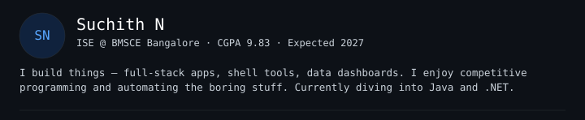

<!-- Skills -->
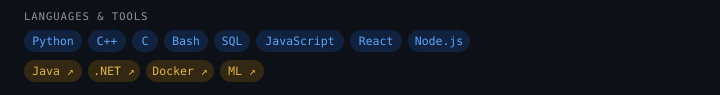

<!-- CLI animation — after header and skills -->

  

<!-- Divider -->
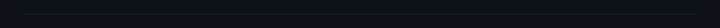

<!-- Projects — each card is a clickable link to your repo -->
<a href="https://github.com/SeekerSuchi/epass-event-management">
  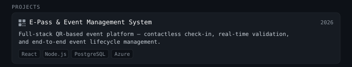
</a>
<a href="https://github.com/SeekerSuchi/data-visualization-tool">
  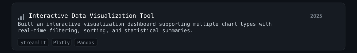
</a>
<a href="https://github.com/SeekerSuchi/cli-typing-game">
  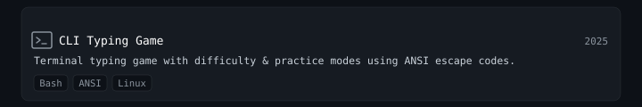
</a>
<a href="https://github.com/SeekerSuchi/backup-automator">
  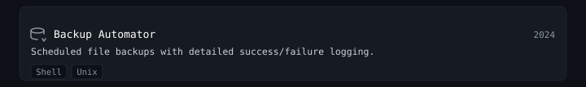
</a>

<!-- Divider -->

<!-- Stats -->
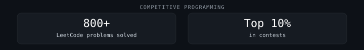

<!-- Divider -->

<!-- Reach Me — label + buttons all center aligned -->

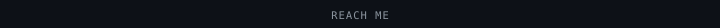

&nbsp;&nbsp;<a href="mailto:suchithn2005@gmail.com">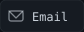</a>&nbsp;&nbsp;

